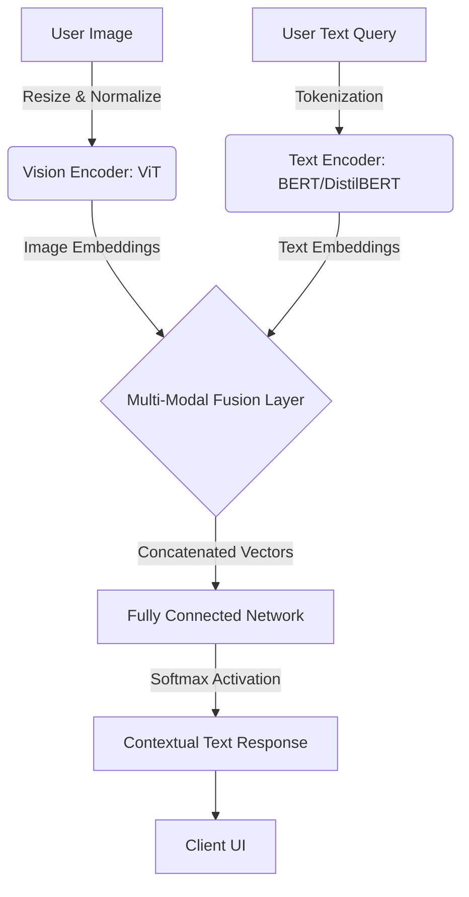

<div align="center">
  

  <h1>Conversational Visual Question Answering (VQA) System</h1>
  <p><b>An End-to-End Deep Learning Architecture for Multi-Modal Contextual Interactions</b></p>

  [](https://www.python.org)
  [](https://pytorch.org/)
  [](https://huggingface.co/)
  [](https://fastapi.tiangolo.com/)
</div>

<br/>

## Executive Summary

This project implements a state-of-the-art Visual Question Answering (VQA) pipeline integrated into a conversational interface. By bridging natural language processing (NLP) and computer vision (CV), the system allows users to query images in natural language and receive lexically and grammatically structured responses based on the visual context. 

Developed as a proof-of-concept for the Smart India Hackathon (SIH) 2025, this repository demonstrates proficiency in multimodal neural network architectures, API design, and frontend integration.

---

## System Architecture

The core engine relies on a dual-encoder architecture that projects both visual and textual inputs into a shared latent space for classification and generative answering.



---

## Technical Stack & Dependencies

* **Modeling & Inference:** PyTorch, Hugging Face `transformers` (Vision Transformer, BERT)
* **Backend Services:** FastAPI, Uvicorn, Python `asyncio`
* **Frontend Interface:** Streamlit (for rapid prototyping and state management)
* **Image Processing:** OpenCV, Pillow (PIL)

---

## Core Capabilities & Business Value

1. **Granular Object Analysis:** Goes beyond bounding boxes to understand object attributes (color, texture, spatial relationships).
2. **Context-Aware Memory:** Maintains conversational state, allowing for follow-up questions without requiring context repetition.
3. **Low-Latency Inference:** Optimized model loading and tensor operations to ensure real-time user experience suitable for production deployments.

---

## System Demonstration

<div align="center">
  
  <p><i>The Streamlit-based UI handles asynchronous calls to the inference engine.</i></p>
</div>

### Inference Log Example

```text
[INFO] Image loaded: target_image.jpg (1024x768)
[USER_QUERY] "What objects are visible on the wooden table?"
[VQA_ENGINE] Processing ViT embeddings... Done (120ms).
[VQA_ENGINE] Processing BERT tokenization... Done (45ms).
[VQA_ENGINE] Fusing tensors...
[PREDICTION] Confidence: 0.94
[RESPONSE] "There is a ceramic coffee mug, a pair of reading glasses, and an open laptop on the wooden table."
```

---

## Local Development & Deployment

### 1. Environment Setup
It is highly recommended to use a dedicated environment to avoid dependency conflicts.

```bash
git clone [https://github.com/your-username/vqa-conversational-agent.git](https://github.com/your-username/vqa-conversational-agent.git)
cd vqa-conversational-agent
python3 -m venv env
source env/bin/activate
pip install --upgrade pip
pip install -r requirements.txt
```

### 2. Initializing the Inference Engine (Backend)
The backend utilizes FastAPI for robust, high-performance endpoint serving.

```bash
cd src/backend
uvicorn main:app --host 0.0.0.0 --port 8000 --reload
# View API documentation at http://localhost:8000/docs
```

### 3. Launching the Client Application (Frontend)
Open a separate terminal session, activate the environment, and start the Streamlit server.

```bash
cd src/frontend
streamlit run app.py
```

---

## Repository Structure

```text
.
├── src/
│   ├── backend/                 # FastAPI application and routing
│   │   ├── main.py              # Application entry point
│   │   ├── model_loader.py      # Weights initialization and tensor management
│   │   └── inference.py         # Forward pass logic
│   ├── frontend/                # Streamlit UI logic
│   │   └── app.py               
│   └── utils/                   # Preprocessing and text-cleaning scripts
├── notebooks/                   # Jupyter environments for hyperparameter tuning
├── requirements.txt             
└── README.md                    
```

---

## Project Contributors
* **[Your Name]** - *Lead ML/Backend Engineer* - [LinkedIn](#) | [GitHub](#)
* **[Teammate Name]** - *Data & Validation Engineer* - [LinkedIn](#) | [GitHub](#)
* **[Teammate Name]** - *Frontend Integration* - [LinkedIn](#) | [GitHub](#)

---
*Distributed under the MIT License. See `LICENSE` for more information.*
```
